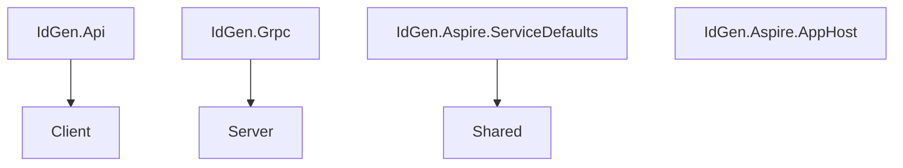

# System Design - Distributed Id Generator

My implementation of Distributed Id Generator in .NET 9

## Overview

This project is a distributed ID generator built using .NET 9. The system is designed to generate unique IDs in a distributed environment, ensuring high availability and scalability. The implementation leverages gRPC for communication between services and includes various modern technologies to enhance resilience, observability, and API documentation.

## Key Features

- **Distributed ID Generation**: Ensures unique ID generation across multiple instances.
- **gRPC Communication**: Utilizes gRPC for efficient and robust communication between services.
- **Resilience and Observability**: Integrates with OpenTelemetry for monitoring and resilience.
- **API Documentation**: Uses Swagger for API documentation and OpenAPI for client generation.

## Technologies Used

- **.NET 9**: The latest version of .NET for building high-performance applications.
- **gRPC**: A high-performance RPC framework for communication between services.
- **OpenTelemetry**: Provides observability into the system with tracing and metrics.
- **Swagger/OpenAPI**: For API documentation and client generation.
- **Protobuf**: Protocol Buffers for efficient serialization of messages.

## Project Structure

- **IdGen.Api**: The API project that acts as a client to the gRPC service.
- **IdGen.Grpc**: The gRPC service that handles ID generation.
- **IdGen.Aspire.ServiceDefaults**: Contains shared service configurations and defaults for observability and resilience.
- **IdGen.Aspire.AppHost**: The application host for running the services.

## Getting Started

### Prerequisites

- .NET 9 SDK
- Visual Studio 2022

### Building the Project

1. Clone the repository: `git clone https://github.com/your-repo/distributed-id-generator.git`
2. Navigate to the solution directory: `cd distributed-id-generator`
3. Run the Aspire AppHost project: `dotnet run`
    
# Contributing

Contributions are welcome! Please open an issue or submit a pull request for any improvements or bug fixes.

## License

This project is licensed under the MIT License.
